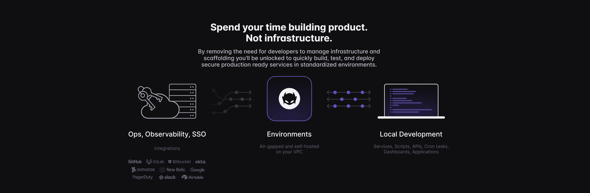

www.wayscript.com

## Create Internal Tools and Bots
 ### - Clone from GitHub Feature and How to Use
  * [Youtube Tutorial](https://youtu.be/qeGAyIs9CQw)
  * [Reference README]()
  * [Reference WayScript Script]()
 ### - FastAPI Quickstart Tutorial | Build and Host Responsive APIs
  * [Youtube Tutorial](https://youtu.be/ura1p4W0D0k)
  * [Reference README](https://app.wayscript.com/lairs/764595a4-d740-43c6-aac1-abdee59a67e7/public/)
  * [Reference GitHub Code](https://github.com/wayscript/wsx_tools/blob/master/scripts/FastAPI/main.py)
 ### - Build a Twilio Service Application to Send Messages
  * [Youtube Tutorial](https://youtu.be/44fWIvPJpyI)
  * [Reference README]()
  * [Reference GitHub Code](https://github.com/wayscript/wsx_tools/tree/master/scripts/integrations/twilio/send-sms)
  * [Additional WayScript Resources](https://docs.wayscript.com/quickstart/host-a-flask-server)
 ### - Setup Hosted Endpoints to Receive Requests, Webhooks in Minutes
  * [Youtube Tutorial](https://youtu.be/YEmzWUJBydM)
  * [Reference README](https://app.wayscript.com/lairs/a3b17875-6356-4e65-9f6a-359f6e701f61/public/)
  * [Reference WayScript Script]()
  * [Additional WayScript Resources](https://docs.wayscript.com/using-wayscript/sdk/example-identify-requester-to-protected-endpoints)
 ### - Get Started Building Tools with WayScript - Flask Startup #1 | Internal Development Platform
  * [Youtube Tutorial](https://youtu.be/eWR4gb84EsI)
  * [Reference README]()
  * [Reference WayScript Script]()
  * [Bootstrap Examples](https://getbootstrap.com/docs/4.0/examples/)
  * [Bootstrap Resources](https://getbootstrap.com/docs/5.1/getting-started/introduction/)
  * [Flask Resource](https://flask.palletsprojects.com/en/2.0.x/patterns/templateinheritance/)
  * [Additional WayScript Resources](https://docs.wayscript.com/quickstart/host-a-flask-server)
 ### - Host Scalable Node Express Applications in Minutes | SB Admin Dashboard Template
  * [Youtube Tutorial](https://youtu.be/l-hC0_zSLk8)
  * [Reference README](https://app.wayscript.com/lairs/e56e1c07-5239-43a5-ba07-88410fb3f246/public/)
  * [Reference Code](https://startbootstrap.com/theme/sb-admin-2)
 ### - Connect Zapier to Flask Apps in WayScript
  * [Youtube Tutorial](https://youtu.be/0VUB_BF0dCQ)
  * [Reference README]()
  * [Reference WayScript Script]()
  * [Additional WayScript Resources](https://docs.wayscript.com/quickstart/host-a-flask-server)
 ### - Perform Sentiment Analysis on Twitter Tweets | HuggingFace, Twitter, WayScript
  * [Youtube Tutorial](https://youtu.be/Z_BJ2gfHnFY)
  * [Reference README]()
  * [Reference WayScript Script]()
  * [Twitter Resources](https://developer.twitter.com/en/docs/authentication/oauth-2-0/bearer-tokens)
  * [HuggingFace Resources](https://huggingface.co/cardiffnlp/twitter-roberta-base-sentiment)
 ### - Build Natural Language Processing Tools Using HuggingFace and WayScript
  * [Youtube Tutorial](https://youtu.be/pVXfIinjuCo)
  * [Reference README](https://app.wayscript.com/lairs/f90044f6-7fc4-4a97-9dad-01ad189307f8/public/)
  * [Reference WayScript Script]()

## Python Programming in the Cloud
 ### - Setting Up and Comparing Flask, FastAPI, and Django Python Apps in WayScript
  * [Youtube Tutorial](https://youtu.be/8-tFhbanUi8)
  * [Reference README]()
  * [Reference GitHub Code](https://github.com/wayscript/wsx_tools/tree/master/scripts/Framework-Comparison)
  * [Additional WayScript Resources](https://docs.wayscript.com/quickstart/host-a-flask-server)

## Task Automation
 ### - Automatically Execute Multiple Python Files at Once with CRON Jobs | Automate Python Scripts
  * [Youtube Tutorial](https://youtu.be/La9idSX6QDc)
  * [Reference README]()
  * [Reference WayScript Script]()
  * [Bash Cheatsheet](https://devhints.io/bash)
 ### - Automate Creating Excel Reports and Send via Email
  * [Youtube Tutorial](https://youtu.be/sZZYyrjIkdo)
  * [Reference README]()
  * [Reference GitHub Code](https://github.com/wayscript/wsx_tools/blob/master/services/Send_email_daily/production-by-shift.py)
 ### - Execute and Automate Selenium Powered Applications
  * [Youtube Tutorial](https://youtu.be/yO8xJwIhY9E)
  * [Reference README](https://app.wayscript.com/lairs/e6c2e57c-b383-4408-b770-9f3bad890e8e/public/)
  * [Reference GitHub Code](https://github.com/wayscript/wsx_tools/blob/master/scripts/Build-Process-Datasets/simple_selenium_example.py)
 ### - Automate JavaScript Executions on Daily, Hourly Intervals | CRON & Node
  * [Youtube Tutorial](https://youtu.be/kw3BC52XdVs)
  * [Reference README]()
  * [Reference WayScript Script]()
 ### - Golang CRON Job Tutorial | Execute Go Files Daily, Hourly
  * [Youtube Tutorial](https://youtu.be/vH_zNZ_Xsgo)
  * [Reference README](https://app.wayscript.com/lairs/dc69ba9a-69c0-4210-897d-a0ac7dd81243/public/)
  * [Reference GitHub Code](https://github.com/wayscript/wsx_tools/blob/master/scripts/Cron-Automations/send_get.go)
 ### - Daily Report Generation from Database Using Python and CRON
  * [Youtube Tutorial](https://youtu.be/8_0Fc9zzMrk)
  * [Reference README]()
  * [Reference WayScript Script]()
 ### - Automate Python Scripts with CRON Jobs
  * [Youtube Tutorial](https://youtu.be/YtPyFAmFopg)
  * [Reference README](https://app.wayscript.com/lairs/1de11edc-1495-4aed-9695-26cc672f0de7/public/)
  * [Reference WayScript Script]()
 ### - Build Slack Automation Tools | Flask Server API Bots
  * [Youtube Tutorial](https://youtu.be/yXXJay3ds-I)
  * [Reference README](https://app.wayscript.com/lairs/2704e270-4c75-4993-91e7-56ffa034b84d/public/)
  * [Reference GitHub Code](https://github.com/wayscript/wsx_tools/tree/master/services/slack/slack-bot)
  * [Reference Scopes](https://github.com/wayscript/wsx_tools/blob/master/static/slack/SlackAPIScopes.jpg)

## Build & Process Datasets
 ### - Convert SQL DB Data to CSV
  * [Youtube Tutorial](https://youtu.be/8_0Fc9zzMrk)
  * [Reference README](https://app.wayscript.com/workspaces/Youtube-Demo/lairs/sql-to-csv/readme/)
  * [Reference WayScript Script](https://app.wayscript.com/lairs/d935d64a-8b26-4ed3-9c9e-98941573709a/public)
 ### - Extract Data from SQL Databases with Python
  * [Youtube Tutorial](https://youtu.be/2DuXpp7QvO4)
  * [Reference README]()
  * [Reference WayScript Script]()
 ### - Extract MongoDB Info via API Inside WayScript Lairs
  * [Youtube Tutorial](https://youtu.be/gmzWyNpQVoc)
  * [Reference README]()
  * [Reference WayScript Script]()
 ### - Upload Excel Data into WayScript
  * [Youtube Tutorial](https://youtu.be/iP22_WX9gxk)
  * [Reference README]()
  * [Reference WayScript Script]()
 ### - Create Graphs from Excel Data Easily with Pandas | WayScript Hosted
  * [Youtube Tutorial](https://youtu.be/cQifggf4GAc)
  * [Reference README]()
  * [Reference WayScript Script]()
 ### - Working with Excel Data Inside WayScript Lairs
  * [Youtube Tutorial](https://youtu.be/ZWvAnP8Oirw)
  * [Reference README]()
  * [Reference WayScript Script]()
 ### - Query SQL Data and Create HTML Tables Using It
  * [Youtube Tutorial](https://youtu.be/uZqO_PoLDi8)
  * [Reference README]()
  * [Reference WayScript Script]()
  * [Additional WayScript Resources](https://docs.wayscript.com/quickstart/host-a-flask-server#configure-deploy-trigger)
 ### - Insert SQL Statements Overview and Examples | Insert SQL Data with Python mysql-connector
  * [Youtube Tutorial](https://youtu.be/Wov94SeUz3s)
  * [Reference README]()
  * [Reference GitHub Code](https://gist.github.com/Derrick-Sherrill/8266887036b3478010b29e0718beff9d)
 ### - Quickly Excecute SQL Online | Run SQL Files from your Browser
  * [Youtube Tutorial](https://youtu.be/k9DRIqUQGj8)
  * [Reference README]()
  * [Reference GitHub Code](https://gist.github.com/Derrick-Sherrill/9454e54b850c28f631b7f6e7b6e0a3d6)
  * [MYSQL Resource](https://dev.mysql.com/doc/connector-python/en/)
  * [Additional WayScript Resources](https://docs.wayscript.com/platform/lairs/environment-variables)
 ### - Work with Google Sheets Data in your Python Scripts | Google Sheets API Walkthrough
  * [Youtube Tutorial](https://youtu.be/16JjZpocsg0)
  * [Reference README]()
  * [Reference GitHub Code](https://gist.github.com/Derrick-Sherrill/9e6f22dc390d8c23f9cd04aae61ed614)
  * [Google Cloud Platform](https://console.cloud.google.com/)
  * [Python Quickstart](https://developers.google.com/sheets/api/quickstart/python)
 ### - Setup a Database API Service for SQL DBs | Read, Write, Query
  * [Youtube Tutorial](https://youtu.be/DVA0ZXpLWuo)
  * [Reference README]()
  * [Reference GitHub Code](https://github.com/wayscript/wsx_tools/tree/master/services/databases/sql_database_api)
  * [Additional WayScript Resources](https://docs.wayscript.com/quickstart/host-a-flask-server)

## Trigger Notifications & Alerts

## Create Web Interfaces
 ### - Upload Files to S3 Buckets with WayScript | AWS S3 Part 2
  * [Youtube Tutorial](https://youtu.be/KdT0oyRJoQo)
  * [Reference README]()
  * [Reference WayScript Script]()
 ### - Create Interactive Websites with WayScript
  * [Youtube Tutorial](https://youtu.be/mAiGf4vfteQ)
  * [Reference README]()
  * [Reference GitHub Code](https://github.com/wayscript/wsx_tools/tree/master/quickstart-templates/sample-customer-site)
  * [HTML Templates](https://github.com/wayscript/wsx_tools/tree/master/quickstart-templates/sample-customer-site)
  * [Additional WayScript Resources](https://docs.wayscript.com/quickstart/host-a-flask-server)
 ### - AWS S3 Service with WayScript
  * [Youtube Tutorial](https://youtu.be/z9OCFA2aMcc)
  * [Reference README]()
  * [Reference GitHub Code](https://github.com/wayscript/wsx_tools/tree/master/services/s3-create-bucket)
  * [IAM Tutorial](https://docs.aws.amazon.com/IAM/latest/UserGuide/id_users_create.html)
  * [Additional WayScript Resources](https://docs.wayscript.com/quickstart/host-a-flask-server)
 ### - How to Quickly Upload and Host Go Servers with WayScript
  * [Youtube Tutorial](https://youtu.be/6cNC3DF_Bg4)
  * [Reference README]()
  * [Reference WayScript Script]()
 ### - Build and Host Bootstrap Webpages with Flask and WayScript
  * [Youtube Tutorial](https://youtu.be/6qJaQVBpqSU)
  * [Reference README]()
  * [Reference WayScript Script]()
  * [Bootstrap Template](https://getbootstrap.com/docs/4.3/getting-started/introduction/)
  * [Bootstrap Components](https://getbootstrap.com/docs/4.3/examples/)
  * [Flask Resource](https://flask.palletsprojects.com/en/2.1.x/)
 ### - Set up and Host Node Express Servers in 3 Minutes
  * [Youtube Tutorial](https://youtu.be/v6opIdJYGnI)
  * [Reference README]()
  * [Reference GitHub Code](https://gist.github.com/Derrick-Sherrill/5f09decdc35e75c88bdedfa8a6478ed9)
  * [Additional Reference GitHub Code](https://gist.github.com/Derrick-Sherrill/a848b142dea557f56d7b301f8f2de8c5)

## WayScript Features
 ### - WayScript Permissions Management Prebuilt Features
  * [Youtube Tutorial](https://youtu.be/Hinyn0HnXzY)
  * [Reference README]()
  * [Reference WayScript Script]()
 ### - WayScript Autosync Demo
  * [Youtube Tutorial](https://youtu.be/YXPpDTefTvs)
  * [Reference README]()
  * [Reference WayScript Script]()
